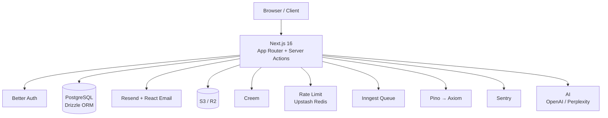

<p align="center">
  <br>
  
  <br>
  <h1 align="center">mAIrror</h1>
  <p align="center">
    AI Brand Visibility Monitoring — see how AI search engines describe your brand, track competitors, and get actionable improvement plans.
  </p>
  <p align="center">
    <a href="https://github.com/evepupil/mAIrror/blob/master/LICENSE">
      
    </a>
    <a href="https://nextjs.org/">
      
    </a>
    <a href="https://www.typescriptlang.org/">
      
    </a>
    <a href="https://tailwindcss.com/">
      
    </a>
  </p>
  <p align="center">
    <a href="#-what-is-mairror">What is mairror?</a> •
    <a href="#-how-it-works">How It Works</a> •
    <a href="#-quick-start">Quick Start</a> •
    <a href="#-project-structure">Structure</a> •
    <a href="#-deployment">Deployment</a>
  </p>
</p>

---

## What is mairror?

mairror (mAIrror) is an **AI Brand Visibility Monitoring** service. It helps you understand how AI platforms perceive your brand:

- **Free Instant Scan** — enter a domain, get a real-time visibility report across AI platforms
- **Continuous Monitoring** — track brand keyword visibility week over week with trend charts
- **Competitive Intelligence** — compare your AI visibility against competitors
- **Readiness Audit** — 5-dimension technical audit (llms.txt, robots.txt, JSON-LD, Core Web Vitals, content)
- **Weekly Reports** — automated email reports with visibility scores and change tracking
- **Alerts** — notified when your brand visibility drops significantly

### How It's Different

Traditional SEO tools track Google rankings. mairror tracks **AI platform visibility** — how ChatGPT, Perplexity, Claude, and Bing Copilot describe and reference your brand. AI search results are non-deterministic, so we measure **mention rate** (how often your brand appears across prompt variants) rather than "rankings".

## How It Works

```
1. Enter your domain → instant free scan (no signup)
2. See your AI visibility score across platforms
3. Sign up to monitor keywords weekly
4. Get automated reports + competitor analysis
5. Run readiness audits to improve AI discoverability
```

## Features

| Category | Highlights |
|----------|-----------|
| **Framework** | Next.js 16 (App Router, Turbopack), React 19, TypeScript |
| **Styling** | Tailwind CSS 4, Shadcn/UI, Radix UI, dark mode |
| **Database** | PostgreSQL, Drizzle ORM, Neon serverless |
| **Auth** | Better Auth — email/password, Google OAuth, role-based access |
| **Payments** | Creem subscription billing, webhooks, multi-tier pricing |
| **Monitoring** | AI brand visibility scanning, keyword tracking, trend charts |
| **Competitors** | Side-by-side visibility comparison, monthly reports |
| **Audits** | 5-dimension AI readiness: llms.txt, robots.txt, JSON-LD, CWV, content |
| **Reports** | Weekly email reports, monthly competitor reports, alert notifications |
| **Email** | Resend delivery, React Email templates |
| **Async Jobs** | Inngest background queue — scheduled monitoring, report generation, alerts |
| **i18n** | full en/zh bilingual routing via next-intl |
| **Rate Limiting** | Upstash Redis sliding window — gracefully degrades when unconfigured |
| **Logging** | Pino structured logging → Axiom cloud — console fallback |
| **Monitoring** | Sentry error tracking — auto-capture, user context, graceful degradation |
| **Tooling** | Biome (lint + format), pnpm, strict TypeScript |

> **Graceful degradation** — every optional service (rate limiting, logging, monitoring, async jobs) falls back to a safe local mode when its environment variable is missing. Start with 3 env vars and add services incrementally.

## Tech Stack



## Quick Start

Three env vars are enough to launch:

```bash
git clone git@github.com:evepupil/mAIrror.git
cd mAIrror
pnpm install
cp .env.example .env.local
```

Edit `.env.local`:

```bash
DATABASE_URL=postgresql://...
BETTER_AUTH_SECRET="your-secret"
BETTER_AUTH_URL="http://localhost:3000"
```

```bash
pnpm db:push    # push Drizzle schema to your DB
pnpm dev        # http://localhost:3000
```

### Required for Core Features

| Service | Env Var | What You Get |
|---------|---------|-------------|
| OpenAI | `OPENAI_API_KEY` | AI visibility scanning, monitoring, audits |
| Inngest | `INNGEST_EVENT_KEY` | Background monitoring, weekly reports, alerts |
| Resend | `RESEND_API_KEY` | Email reports and alert notifications |
| Creem | `CREEM_API_KEY` + webhook secret | Subscription payments |

### Optional Services

| Service | Env Var | What You Get |
|---------|---------|-------------|
| Upstash | `UPSTASH_REDIS_REST_URL` + `UPSTASH_REDIS_REST_TOKEN` | API rate limiting |
| Axiom | `AXIOM_TOKEN` + `AXIOM_DATASET` | Structured cloud logging |
| Sentry | `SENTRY_DSN` | Error monitoring |

## Project Structure

```
src/
├── app/                        # Next.js App Router
│   └── [locale]/               # i18n routing (en / zh)
│       ├── (marketing)/        # Landing page, consulting
│       ├── (dashboard)/        # Dashboard, monitoring, settings
│       └── (admin)/            # Admin panel
├── components/ui/              # Shadcn/UI primitives
├── features/                   # Feature-based modules
│   ├── detection/              # Free domain visibility scan
│   ├── monitoring/             # Keyword monitoring, reports, alerts, audits, competitors
│   ├── marketing/              # Header, footer, hero, pricing, CTA
│   ├── dashboard/              # Sidebar, stat cards
│   ├── admin/                  # Admin sidebar, user management
│   ├── auth/                   # Sign-in, sign-up, auth client
│   ├── settings/               # Profile, billing, account management
│   ├── support/                # Ticket system
│   ├── subscription/           # Plan management, privilege checks
│   ├── mail/                   # React Email templates, Resend sender
│   ├── storage/                # S3 / R2 abstraction
│   └── shared/                 # Theme toggle, language switcher, icons
├── db/                         # Drizzle schema definitions
├── config/                     # Site, nav, payment, subscription plan configs
├── inngest/                    # Inngest client + function registry
├── lib/                        # Auth, rate-limit, logger, monitoring, safe-action
└── test/                       # Integration tests
```

## Database Schema

Core monitoring tables:

| Table | Purpose |
|-------|---------|
| `monitored_keyword` | User's brand keywords for monitoring |
| `monitoring_result` | Append-only AI platform query results |
| `competitor` | Competitor domains for comparison |
| `competitor_result` | Competitor monitoring results |
| `visibility_report` | Weekly/monthly report records |
| `audit_result` | AI readiness audit results |
| `alert_rule` | User-configured alert thresholds |

## Inngest Jobs

| Job | Schedule | Purpose |
|-----|----------|---------|
| `monitoring/keyword.check` | On-demand | Query AI platforms for a keyword |
| `reports/weekly` | Monday 9AM UTC | Generate and email weekly reports |
| `reports/competitor-monthly` | 1st of month | Generate monthly competitor reports |
| `alerts/visibility-drop` | Every 6 hours | Check for visibility drops, send alerts |

## Routes

| Route | Description | Access |
|-------|-------------|--------|
| `/` | Landing page + free scan | Public |
| `/#pricing` | Subscription plans | Public |
| `/docs` | Documentation | Public |
| `/consulting` | Consulting services | Public |
| `/sign-in` | Sign in | Public |
| `/sign-up` | Sign up | Public |
| `/dashboard` | User dashboard | Auth required |
| `/dashboard/monitoring` | Brand monitoring overview | Auth required |
| `/dashboard/settings` | Account settings | Auth required |
| `/dashboard/support` | Support tickets | Auth required |
| `/admin` | Admin dashboard | Admin only |
| `/admin/users` | User management | Admin only |
| `/admin/tickets` | Ticket management | Admin only |

## Scripts

```bash
pnpm dev            # Next.js dev (Turbopack)
pnpm build          # Production build
pnpm start          # Production server
pnpm lint           # Biome lint
pnpm format         # Biome format
pnpm check          # lint + format in fix mode
pnpm typecheck      # tsc --noEmit
pnpm db:generate    # Drizzle kit generate
pnpm db:push        # Drizzle kit push (dev)
pnpm db:studio      # Drizzle Studio UI
pnpm test:run       # Run integration tests
```

## Deployment

### Vercel

Zero-config — push to `master`, Vercel auto-detects Next.js.

### Self-hosted

The repo includes `deploy-build.bat` (Windows build machine) + `start-prod.sh` (Linux server). Edit SSH host and key paths, then:

```bat
:: Windows local machine
deploy-build.bat
```

The script: builds → tars `.next` + config → SCPs → remote server unpacks → PM2 restarts.

## Contributing

- **Feature-based code**: place new modules under `src/features/<name>/`.
- **Server Components first**: only add `'use client'` when you need interactivity.
- **Server Actions**: all data mutations go through `next-safe-action` (`actionClient`, `protectedAction`, `adminAction`).
- **Type safety**: every prop, API response, and action schema must be typed.
- **Tests**: add integration tests in `src/test/`.

## License

MIT
